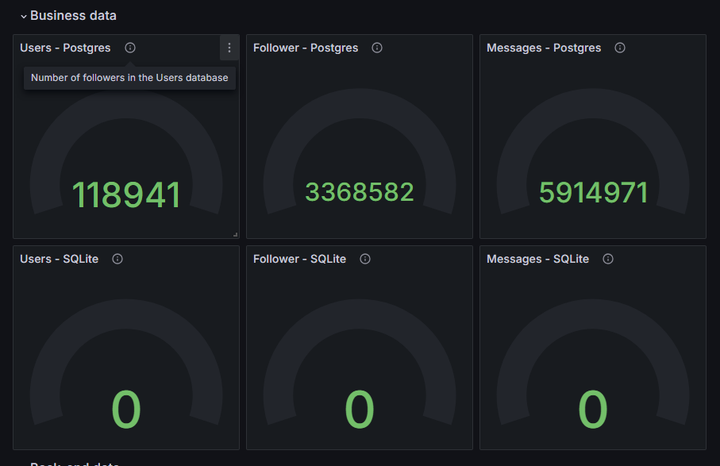

## Monitoring

### Metrics 
For monitoring we use Prometheus with Grafana. We do so by incrementing gauges or vectors whenever an event has successfully occurred. Currently the system is configured to monitor these values:

**business related data**
- amount of users getting created
- amount of new followers on the platform
- amount of new messages posted
- total amount of reads and writes made to the database between releases

**developer oriented data:**
- amount of failed database read-writes
- connection to the database
- successful / failed HTTP requests

Monitoring these gives us an insight to the extend of traffic passing through our API.
For ease of access to the monitored data and for visualization, the group uses Grafanas dashboards.

  

### Logs
For each action in our system a log entry is created. There are different categories of logs such as info, warn and error. Most of our logs are infos, however if a process fails it will be marked as an error which allows us to easily filter and find issues. 

  

  

The logs are first created using ZAP library that that uses a common json format. Both API and App writes logs to standard output and error output. Since all our component run in docker it is easy to collect all our logs at a single place. We use Promtail that is connected to the docker engine which periodically reads logs and ships them to Loki. Grafana uses Loki as source and provides us with an option to execute queries on the logs.   

It is important to note that we, due to time constraints, did not migrate our logs when moving to Kubernetes. The old logs and any new logs are hosted on the old production droplet.

\newpage  

